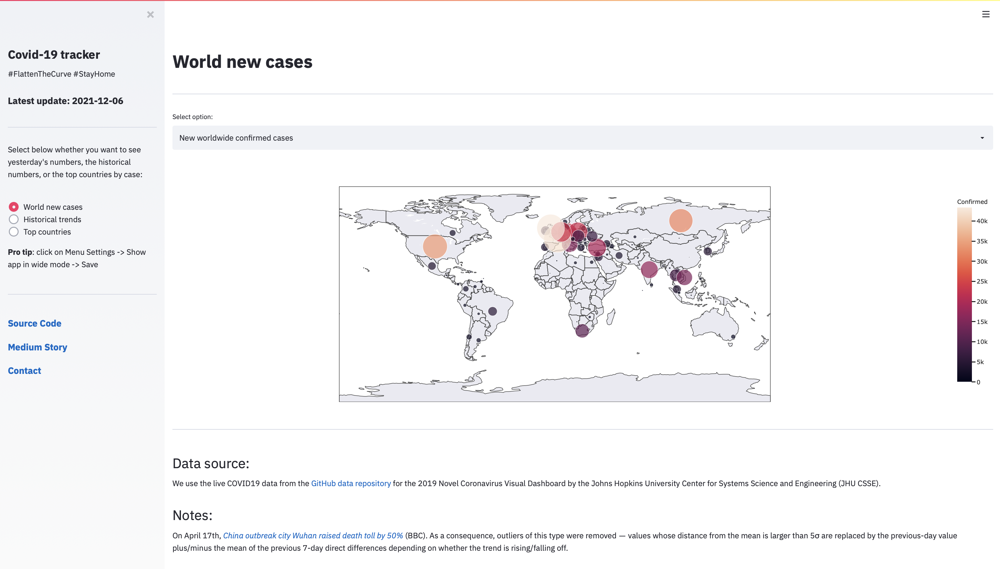
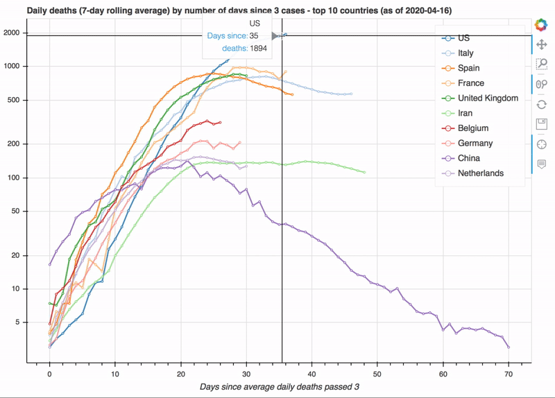

# Live COVID-19 tracker with Airflow

> **Note:** The app is no longer live and maintained. To run it locally you may clone the
> repository, install all requirements in `requirements.txt`, and do
> ```
> streamlit run 3.0App.py
> ```
> 
> * The final live streamlit app looked like in the following screenshot:
> 
> 
> 
> * The final state (2020/09/25) of a previous version is still accessible in this
> [webpage](https://hectoramirez.github.io/covid/COVID19.html).

---

Set of charts automatically updated daily with [Apache Airflow](https://airflow.apache.org). COVID-19 data provided by the Johns Hopkins University Center for Systems Science and Engineering (JHU CSSE). The data can be found in [this GitHub data repository](https://github.com/CSSEGISandData/COVID-19).

* __[~~Link~~]() to the live tracker__

* __A [Medium Story](https://medium.com/p/your-live-covid-19-tracker-with-airflow-and-github-pages-658c3e048304?source=email-2e35a42940fd--writer.postDistributed&sk=343b8c88e348ff738b1f947c38076c97) of this project was featured in the _Data Science_ and _Programming_ topic pages, and was  published in [Towards Data Science](https://towardsdatascience.com)__

[](https://mybinder.org/v2/gh/hectoramirez/Covid19/master?filepath=COVID19_notebook.ipynb)
[](https://hectoramirez.github.io/covid/COVID19.html)
[](https://medium.com/p/your-live-covid-19-tracker-with-airflow-and-github-pages-658c3e048304?source=email-2e35a42940fd--writer.postDistributed&sk=343b8c88e348ff738b1f947c38076c97)
[](https://towardsdatascience.com/your-live-covid-19-tracker-with-airflow-and-github-pages-658c3e048304)
[](https://opensource.org/licenses/MIT)



We use the [bokeh](https://bokeh.org) and [plotly](https://plotly.com) visualization libraries.

### 2.0COVID19_notebook.ipynb

Along the notebook, we
1. Load and clean the data.
2. Show bokeh interactive bar plots for the top countries by confirmed cases, deaths, recoveries and mortality rate.
3. Present the world totals.
4. Compute the daily cases and show bokeh interactive time series plots.
5. We show plotly geographical, interactive maps.

### Automated/

Series of scripts used for Airflow:
* <b>covid19_dag.py</b> Airflow DAG that automates the execution of:
    * <b>covid_func.py</b> Reproduces the code in the Jupyter notebook.
    * <b>git_push.py</b> Commit/push of the plots to the GitHub Pages repository.
    
The tracker _was_ updated daily at 05:00 UTC.